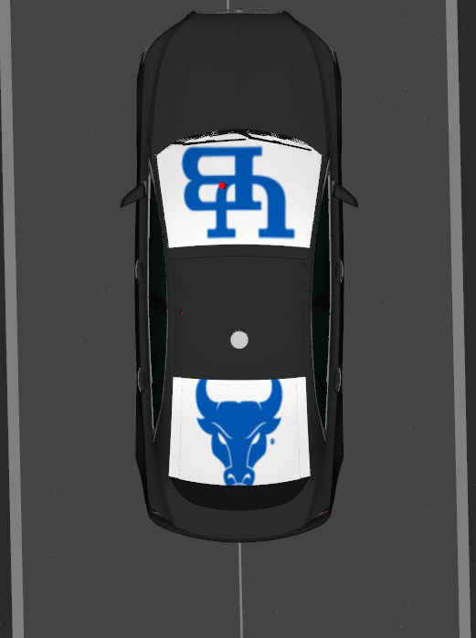

# !!! Sensor Kit Configuration Folder

* **To run the sensor_kit mkz_model make sure you have the below repository in the Autoware**

```cmd
Autoware/src/param/autoware_individual_params/individual_params/config/default/mkz_sensor_kit
```


* Clone the repo from the below link.

```cmd
git clone https://github.com/cavas-ub/default_mkz_sensors.git
```


Clone the package inside the  sensor_kit folder 

```cmd
git clone https://github.com/cavas-ub/mkz_sensor_kit.git
```


## Build package

```cmd
colcon build --symlink-install --package-select mkz_sensor_kit_launch
```

Execute the Autoware package

* Make sure the map folder is present in our your autoware_map or run it on the sample map folder

```cmd
ros2 launch autoware_launch planning_simulator.launch.xml map_path:=$HOME/autoware_map/service_road_inner_loop/ vehicle_model:=mkz_vehicle sensor_model:=mkz_sensor_kit launch_vehicle_interface:=true

```


